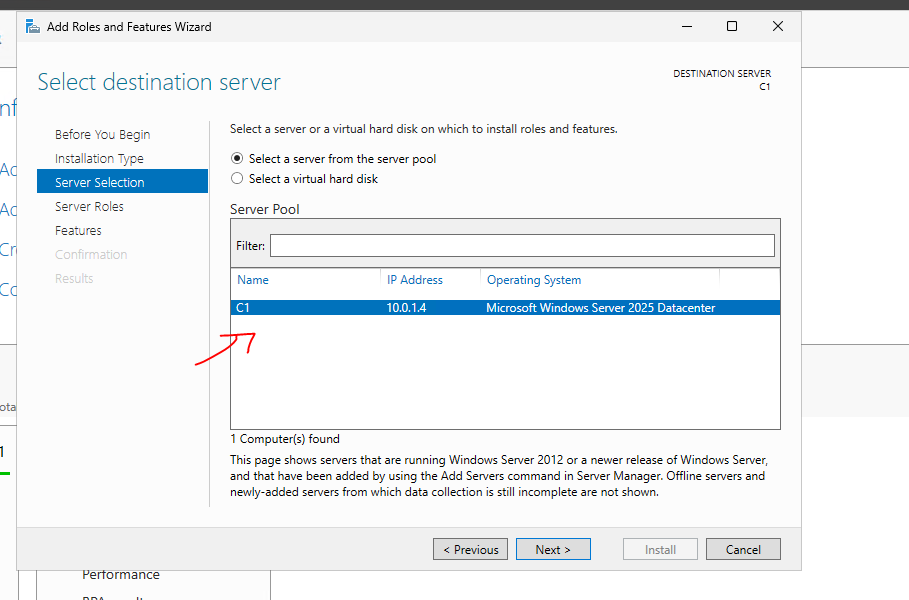
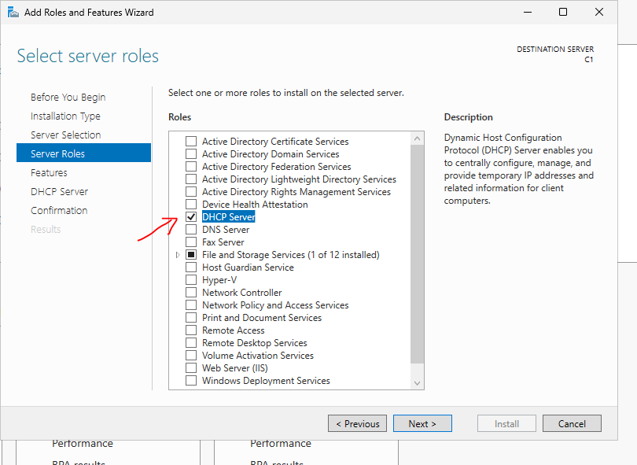
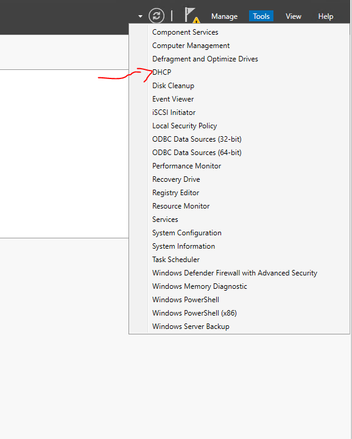
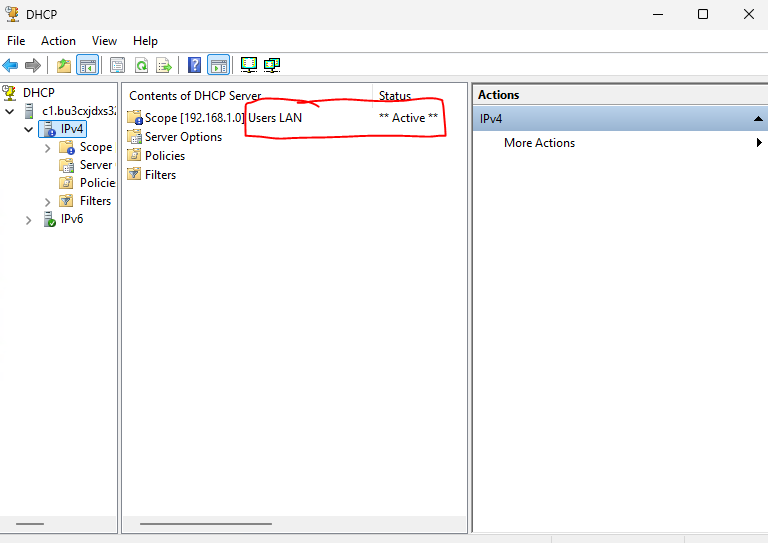
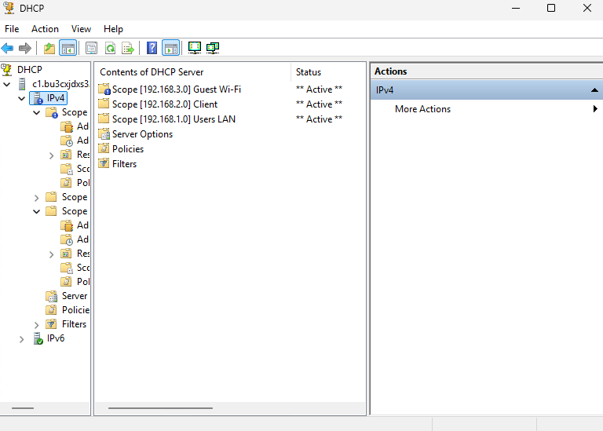
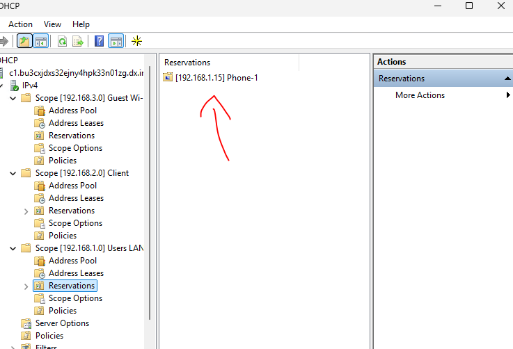

# DHCP Using Microsoft Azure

Deployed and configured a Windows Server 2025 x64 Gen2 DHCP server in Microsoft Azure.

The lab simulates a small business network by deploying a DHCP server, creating multiple DHCP scopes for different network segments, configuring DHCP options, implementing address exclusions and reservations, and activating each scope for automatic IP address assignment.

This lab builds upon the skills presented in the _Active Directory Using Microsoft Azure_ repository. I did this lab _after_ the AD.

---

## Table of Contents

- [Technologies](#technologies)
- [Environment](#environment)
- [Project Objectives](#project-objectives)
- [Implementation](#implementation)
  - [1. DHCP Server Deployment](#1-dhcp-server-deployment)
  - [2. DHCP Scope Configuration](#2-dhcp-scope-configuration)
  - [3. Address Pools & Exclusions](#3-address-pools--exclusions)
  - [4. DHCP Scope Options](#4-dhcp-scope-options)
  - [5. DHCP Reservation](#5-dhcp-reservation)
  - [6. Verification](#6-verification)
- [Skills & Experience Gained](#skills--experience-gained)

## Technologies

- Microsoft Azure
- Windows Server 2025 x64 Gen2
- DHCP Server
- Remote Desktop (RDP)

---

## Environment

| Machine | Operating System | Purpose |
|---------|------------------|------|
| C1 | Windows Server 2025 x64 Gen2 | DHCP Server |

**Azure Virtual Network:** `vn_eur`

---

## Project Objectives

- Deploy a Windows Server DHCP server
- Create multiple DHCP scopes
- Configure address pools and exclusions
- Configure lease durations
- Configure DHCP scope options
- Create DHCP reservations
- Verify scope activation

---

## Implementation

### 1. DHCP Server Deployment

- Created an Azure Windows Server 2025 Datacenter virtual machine.
- Connected the server to the `vn_eur` virtual network.
- Installed the DHCP Server role using Server Manager.
- Verified successful installation through the Windows Server management tools.

---

### 2. DHCP Scope Configuration

Created three DHCP scopes to represent different network segments.

| Scope | Network | Lease Duration |
|--------|---------|---------------|
| Users LAN | 192.168.1.0/24 | 8 Hours |
| Client | 192.168.2.0/24 | 1 Day |
| Guest Wi-Fi | 192.168.3.0/24 | 2 Hours |

Each scope includes:

- A dedicated address pool
- Reserved exclusion ranges
- Automatic activation

---

### 3. Address Pools & Exclusions

Configured individual address pools and exclusion ranges for each network.

#### Users LAN

- Address Pool:
  - 192.168.1.10 – 192.168.1.200
- Exclusion:
  - 192.168.1.10 – 192.168.1.20

#### Client

- Address Pool:
  - 192.168.2.10 – 192.168.2.150
- Exclusion:
  - 192.168.2.10 – 192.168.2.30

#### Guest Wi-Fi

- Address Pool:
  - 192.168.3.50 – 192.168.3.250
- Exclusion:
  - 192.168.3.50 – 192.168.3.60

The shorter lease duration for the Guest Wi-Fi network encourages quicker IP address reuse; typical in a work environment. 

---

### 4. DHCP Scope Options

Configured common DHCP options for every scope.

| Option | Value |
|---------|------|
| 003 Router | 192.168.0.254 |
| 006 DNS Server | Private IP address of C1 |
| 015 DNS Domain Name | indigo.local |

These settings ensure DHCP clients automatically receive their default gateway, DNS server, and DNS search domain.

---

### 5. DHCP Reservation

Created a DHCP reservation within the Users LAN scope for a network phone.

| Device | Reserved IP |
|---------|-------------|
| Phone-1 | 192.168.1.15 |

The reservation guarantees the device always receives the same IP address while remaining centrally managed by DHCP.

---

### 6. Verification

Verified that:

- All DHCP scopes were successfully activated.
- Address pools and exclusions were tuned correctly.
- DHCP reservations were created successfully.

---

## Skills & Experience Gained

This project provided hands-on experience deploying and administering a Windows Server DHCP environment in Microsoft Azure.

Along the way, I gained practical experience configuring DHCP scopes, managing IP address pools and exclusions, configuring DHCP options, implementing DHCP reservations, selecting lease durations based on network requirements, and organizing IP address allocation for multiple network segments using common enterprise practices.

Moreover, this project ties in well with the _Active Directory Using Microsoft Azure_. Together, the concepts of networking has become more clear to me.
